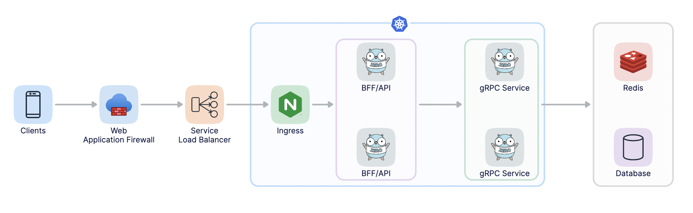
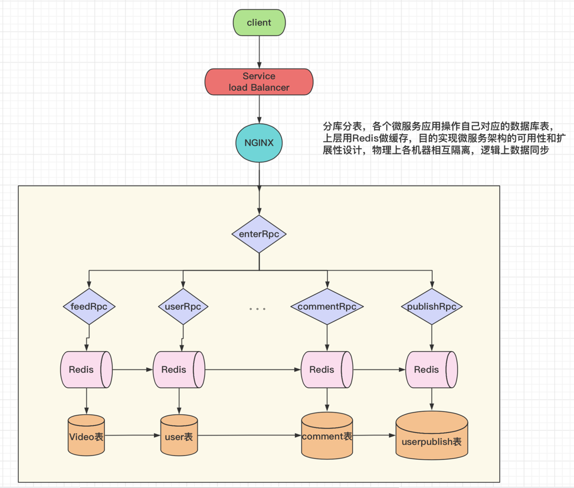
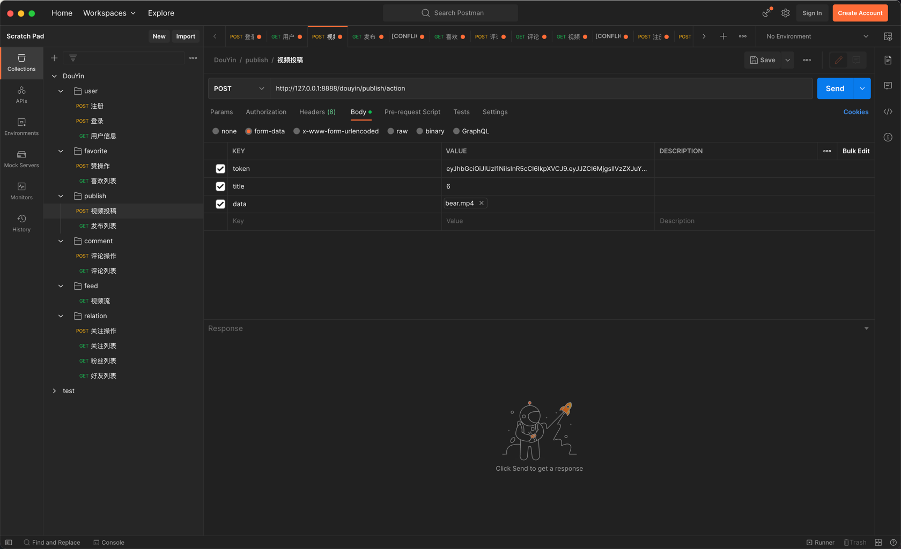
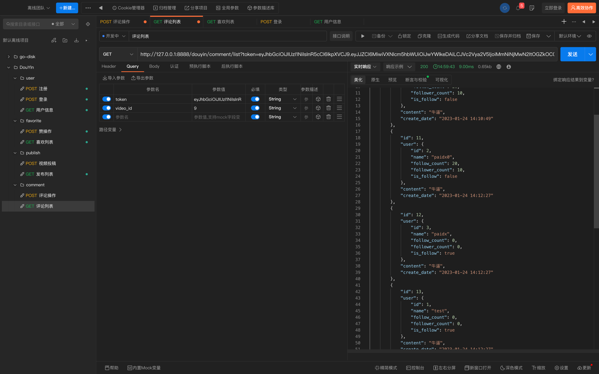

# 抖音极简版

### 👉 [点我去看文档](https://gxlsv6zp0c.feishu.cn/docx/UvErd0aYno8w05xYyVec0xOvnnc) 👈
### 🧚‍♂️😝 演示视频 😝🧚‍♂️

- Enter 网关入口
- user 用户相关
- feed 视频流相关
- publish 投稿发布相关
- favorite 喜欢赞相关
- comment 评论相关
- relation 粉丝关注相关

~~~text
相关依赖
    go mod tidy
安装protoc,protoc-gen-go,protoc-gen-grpc-go
    goctl env check -i -f
生成相应RPC服务
    goctl rpc protoc user.proto --go_out=./pb --go-grpc_out=./pb --zrpc_out=.
生成相应API服务
    goctl api go -api enter.api -dir .
~~~

~~~text
1、先要运行 
    etcd
2、启动Redis
    redis-server
2、启动相应的RPC服务
    go run user.go -f etc/user.yaml
    。。。。。
~~~

~~~text
快速启动
    ./start.sh
    go run douyin.go -f etc/douyin.yaml
~~~

